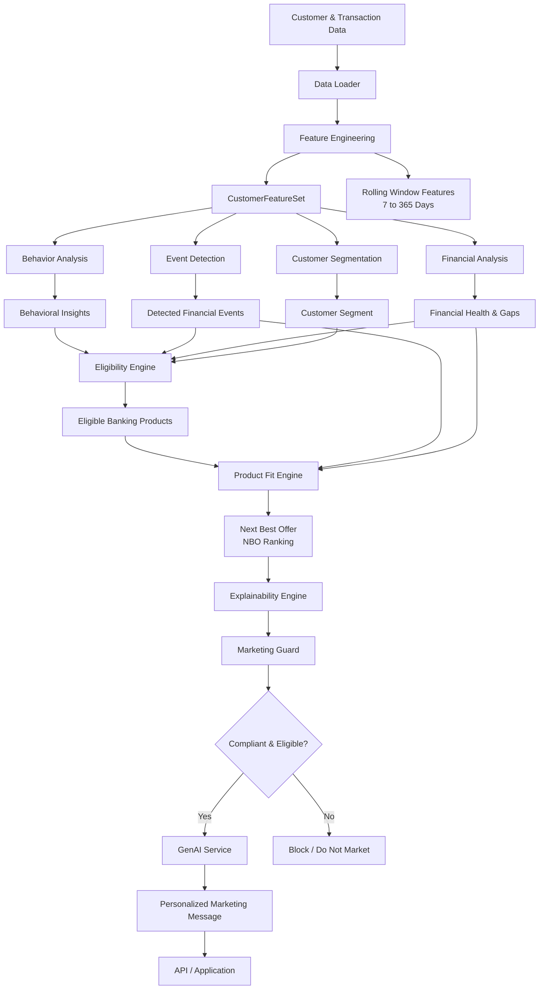

# NPN Bank — Python AI Engine & API Backend

This directory contains the FastAPI server, modular analytical engines, database generation scripts, and Supabase migration utilities for the NPN Bank GenAI Marketing Platform.

---

## 🏗️ Architecture Overview

The backend is structured into modular, decoupled layers:

* **API Gateway (`api_server.py`)**: FastAPI REST API providing authentication (JWT), customer profiling, campaign management, analytics, and Groq GenAI content generation endpoints.
* **AI Intelligence Pipeline (`ai_engine/`)**:

  * `feature_engine.py`: Rolling-window transaction aggregations (7–365 days) and standardized `CustomerFeatureSet`.
  * `behavior_engine.py`: Monthly income/expense trajectory and spending category breakdown.
  * `event_engine.py`: Real-time detection of high-impact financial triggers (flights, hotels, salary credits, medical spends).
  * `financial_analyst.py`: Financial Health Index (0–100) and gap detection (`NO_INVESTMENT`, `NO_INSURANCE`, `OVERSPENDING_DINING`, etc.).
  * `eligibility_engine.py`: Regulatory & credit constraint validation.
  * `product_fit_engine.py`: Tag-based behavioral alignment scoring.
  * `nbo_engine.py`: Next Best Offer multi-objective ranking.
  * `explainability_engine.py`: Deterministic, auditable reasoning generation.
  * `marketing_guard.py`: Compliance, DND consent gate, and campaign fatigue cooldown.
  * `genai_service.py`: Context-aware Groq LLM dynamic copy generation (time-of-day and generational cohort-tailored).
  * `segmentation.py`: Lifecycle and behavioral customer clustering.
  * `data_loader.py`: Dual-source data access (Supabase PostgreSQL + CSV fallback).
* **Database & Migration Tools**:

  * `generate_database.py`: Synthesizes realistic banking customer, account, and transaction datasets.
  * `push_to_supabase.py`: Uploads datasets into Supabase PostgreSQL tables.
  * `Database_csvs/`: Local synthetic CSV dataset storage.

---

## 🔄 AI Engine Pipeline Flowchart

The AI engine processes customer and transaction data through multiple analytical and decision-making stages before generating a personalized banking recommendation.



### Pipeline Summary

```text
Customer Data
      ↓
Data Loader
      ↓
Feature Engineering
      ↓
┌──────────────┬──────────────┬──────────────────┐
↓              ↓              ↓                  ↓
Behaviour      Events         Financial          Segmentation
Analysis       Detection      Analysis           Analysis
└──────────────┴──────────────┴──────────────────┘
                       ↓
               Eligibility Engine
                       ↓
                Product Fit Engine
                       ↓
             Next Best Offer (NBO)
                       ↓
             Explainability Engine
                       ↓
                Marketing Guard
                       ↓
                  GenAI Service
                       ↓
          Personalized Marketing Message
```

---

## 🚀 Getting Started

### 1. Install Dependencies

```bash
python -m venv venv
```

**Windows:**

```bash
.\venv\Scripts\Activate.ps1
```

**Linux/macOS:**

```bash
source venv/bin/activate
```

Install dependencies:

```bash
pip install -r requirements.txt
```

### 2. Configure Environment

Copy `.env.example` to `.env` and configure:

```env
SECRET_KEY=npnbank-super-secret-key-2024
ACCESS_TOKEN_EXPIRE_MINUTES=480
GROQ_API_KEY=your_groq_api_key_here
SUPABASE_URL=https://your-project.supabase.co
SUPABASE_KEY=your_supabase_anon_key
```

### 3. Run the API Server

```bash
uvicorn api_server:app --reload --port 8000
```

Interactive Swagger docs:

http://localhost:8000/docs

### 4. Run the Pipeline CLI Test

```bash
python ai_engine/run_pipeline.py CUST00125
```
