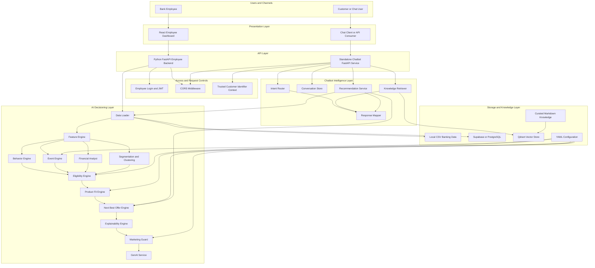
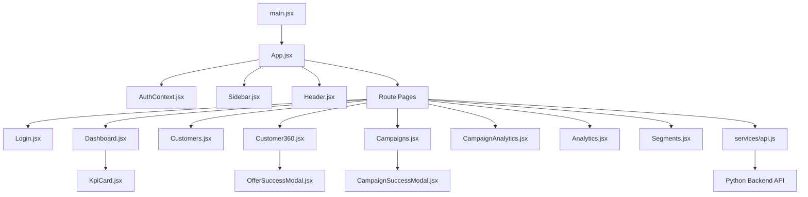
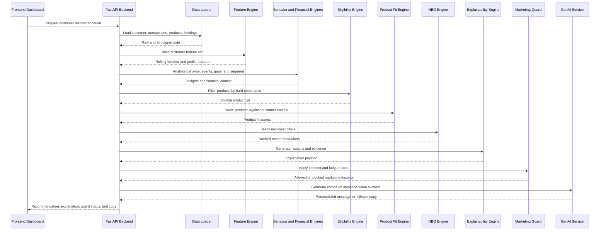
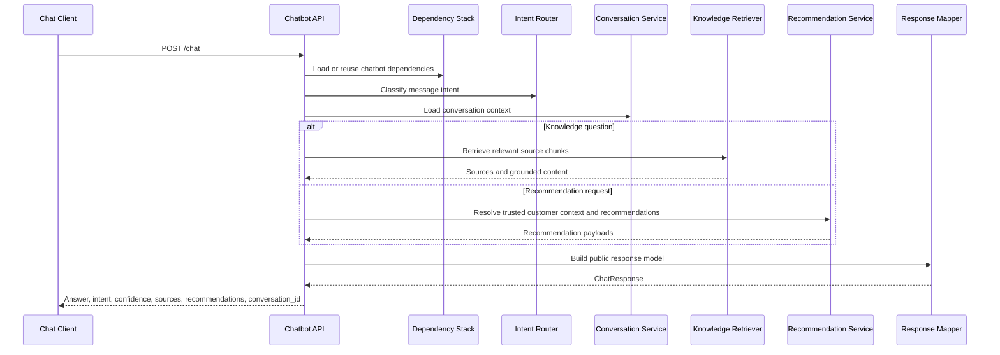
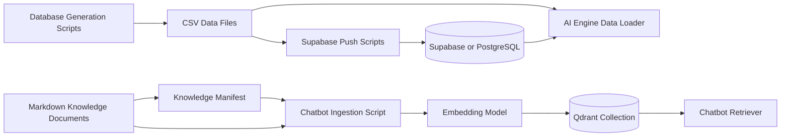

# NPN Bank GenAI Hyper-Personalized Banking Marketing Platform

## 1. Executive Summary

NPN Bank is a full-stack banking intelligence, customer 360, next-best-offer, campaign orchestration, and conversational assistance platform. The project is designed for a banking relationship-management use case where employees need to understand customer behavior, detect financial needs, explain recommendation logic, generate compliant personalized outreach, and monitor campaign outcomes.

The repository combines four major systems:

1. A Python FastAPI backend that powers the employee dashboard and exposes customer, recommendation, campaign, authentication, and analytics endpoints.
2. A modular Python AI engine that transforms raw banking data into customer features, behavioral insights, financial gap assessments, eligibility decisions, product-fit scores, next-best-offer recommendations, explanations, marketing guard decisions, and generated campaign copy.
3. A React and Vite frontend dashboard for employees to authenticate, inspect customers, review customer 360 profiles, view recommendation evidence, create campaigns, and monitor analytics.
4. A standalone chatbot service that provides deterministic banking answers, intent routing, multi-turn conversation handling, retrieval-augmented knowledge lookup, and optional customer-aware recommendation support.

The platform is intended to move retail banking outreach away from broad product blasting and toward auditable, context-aware, customer-benefit-driven engagement.

## 2. Business Problem

Traditional banking marketing often relies on static demographic segments, generic product campaigns, and disconnected customer signals. That approach creates several problems:

- Customers receive offers that do not match their actual financial behavior.
- Relationship managers cannot easily explain why a product was recommended.
- Campaign teams risk contacting customers too frequently or without considering consent preferences.
- Product recommendations can ignore existing holdings, financial gaps, credit constraints, or recent life events.
- Analytics are often separated from the decisioning layer, making closed-loop improvement difficult.

NPN Bank addresses these issues by combining customer data, transaction behavior, product catalogues, deterministic decisioning, explainability, and optional generative content into a single workflow.

## 3. Solution Overview

The central question answered by the platform is:

> Given a customer's current financial profile and recent behavior, what banking product is genuinely relevant, why is the customer eligible, what evidence supports the recommendation, and how should the bank communicate it safely and professionally?

The platform answers this through a layered architecture:

- Data is loaded from Supabase or local CSV files.
- Customer-level features are generated from demographics, holdings, products, and transactions.
- Behavioral and financial engines identify patterns, events, needs, and gaps.
- Product eligibility logic removes unsuitable offers using hard constraints.
- Product-fit and next-best-offer engines rank the most relevant opportunities.
- Explainability logic produces auditable reasons for each recommendation.
- Marketing guardrails enforce consent, fatigue, channel, and safety rules.
- The backend exposes this intelligence through APIs.
- The frontend presents it to employees through dashboard pages.
- The chatbot answers banking questions and can use trusted customer context for personalized recommendations.

## 4. High-Level Architecture



## 5. Runtime Architecture by Layer

### 5.1 Presentation Layer

The presentation layer is implemented in `frontend/`. It is a React application built with Vite. Its responsibilities include:

- Rendering employee login and protected dashboard routes.
- Presenting executive KPIs and analytics summaries.
- Listing customers and exposing customer search or navigation.
- Showing customer 360 records and recommendation context.
- Supporting campaign creation, success feedback, and campaign analytics.
- Calling backend APIs through a central service module.

The frontend is not responsible for decisioning. Recommendation, eligibility, analytics, and campaign logic are expected to come from backend APIs.

### 5.2 Employee Backend API Layer

The employee backend is implemented in `Python/api_server.py`. It is the main API boundary for the dashboard and coordinates:

- FastAPI application initialization.
- CORS policy for local and deployed frontend origins.
- Prototype employee authentication and JWT token generation.
- Lazy loading of customer data and AI engine instances.
- Customer 360 retrieval and aggregation.
- Campaign creation and campaign status workflows.
- Analytics endpoints for dashboard and campaign reporting.
- Optional integrations for email, SMS, Supabase, and Groq.

This layer should remain thin where possible. It should validate API requests, call domain services or AI engine modules, and return structured responses to the frontend.

### 5.3 AI Decisioning Layer

The AI decisioning layer lives in `Python/ai_engine/`. It is organized into focused modules rather than one monolithic model. This makes the system easier to test, explain, and audit.

The decisioning flow is:

1. `data_loader.py` loads customer, transaction, product, and holding data.
2. `feature_engine.py` converts raw records into normalized customer features.
3. `behavior_engine.py` interprets recurring behavior, income patterns, and category spend.
4. `event_engine.py` detects recent high-signal customer events.
5. `financial_analyst.py` identifies financial gaps and computes financial health indicators.
6. `segmentation.py` and `clustering_engine.py` group customers into actionable cohorts.
7. `eligibility_engine.py` removes products that fail hard constraints.
8. `product_fit_engine.py` scores the fit between remaining products and customer needs.
9. `nbo_engine.py` ranks the best available offers.
10. `explainability_engine.py` produces evidence and human-readable reasoning.
11. `marketing_guard.py` applies consent, fatigue, and channel-safety controls.
12. `genai_service.py` creates personalized outreach content when generation is enabled.

### 5.4 Data Layer

The project supports both local and external data paths:

- Local CSV files in `Python/Database_csvs/` provide development and fallback datasets.
- Generated customer 360 datasets are stored in `Python/Database_csvs/generated_customer_360/` and `Python/database_generation_scripts/generated_customer_360/`.
- Supabase or PostgreSQL can be used for persistent application data and campaign workflows.
- YAML configuration in `Python/ai_engine/config/` controls thresholds and ranking weights.

The local CSV path is useful for demos, testing, and development without a remote database. The Supabase path is useful when persistent state, shared campaign data, or deployed API behavior is required.

### 5.5 Chatbot Layer

The chatbot service lives in `chatbot/` and runs separately from the employee backend. It is designed as a standalone FastAPI service with its own package structure. Its responsibilities include:

- Accepting chat requests through `/chat` and simplified question requests through `/ask`.
- Reporting service readiness through `/health`.
- Classifying user intent with deterministic routing.
- Maintaining multi-turn conversation context.
- Loading curated knowledge documents.
- Chunking and embedding knowledge for retrieval.
- Searching Qdrant for source-grounded answers.
- Mapping internal turn results into stable API response models.
- Optionally using trusted customer identifiers to return personalized recommendation context.

The chatbot does not infer identity from free-text messages. Customer-specific behavior should use trusted identifiers passed by the calling application after authentication.

## 6. Detailed Component Architecture

### 6.1 Frontend Component Map



### 6.2 Backend Decisioning Flow



### 6.3 Chatbot Request Flow



### 6.4 Data and Knowledge Ingestion Flow



## 7. Repository Structure

```text
NPN_Cognizant/
├── README.md
├── AI_service.md
├── GenAI_Banking_Marketing_README.md
├── stats.json
├── Python/
│   ├── README.md
│   ├── api_server.py
│   ├── requirements.txt
│   ├── Dockerfile
│   ├── generate_database.py
│   ├── push_to_supabase.py
│   ├── push_customer_360.py
│   ├── push_products_only.py
│   ├── push_customers.py
│   ├── push_investments.py
│   ├── inspect_tables.py
│   ├── list_tables.py
│   ├── fix_schema.py
│   ├── fix_counters.py
│   ├── fix_customers.py
│   ├── test_api.py
│   ├── test_groq.py
│   ├── test_init.py
│   ├── test_json_parse.py
│   ├── output.txt
│   ├── ai_engine/
│   │   ├── README.md
│   │   ├── AI_ENGINE_FLOWCHARTS.txt
│   │   ├── behavior_engine.py
│   │   ├── clustering_engine.py
│   │   ├── data_loader.py
│   │   ├── eligibility_engine.py
│   │   ├── event_engine.py
│   │   ├── explainability_engine.py
│   │   ├── feature_engine.py
│   │   ├── financial_analyst.py
│   │   ├── genai_service.py
│   │   ├── indian_calendar.py
│   │   ├── marketing_guard.py
│   │   ├── nbo_engine.py
│   │   ├── product_fit_engine.py
│   │   ├── run_pipeline.py
│   │   ├── segmentation.py
│   │   └── config/
│   │       ├── README.md
│   │       ├── marketing.yaml
│   │       ├── nbo_weights.yaml
│   │       └── thresholds.yaml
│   ├── Database_csvs/
│   │   ├── README.md
│   │   ├── customers.csv
│   │   ├── raw_transactions.csv
│   │   ├── merchants.csv
│   │   ├── credit_card_products.csv
│   │   ├── debit_card_products.csv
│   │   ├── investment_products.csv
│   │   ├── insurance_products.csv
│   │   ├── loan_products.csv
│   │   └── generated_customer_360/
│   │       ├── README.md
│   │       ├── customer_360.json
│   │       ├── customers.csv
│   │       └── customer product holding CSV files
│   ├── database_generation_scripts/
│   │   ├── README.md
│   │   ├── customer.py
│   │   ├── raw_transactions.py
│   │   ├── credit_card_data.py
│   │   ├── debit_card_data.py
│   │   ├── insurance_data.py
│   │   ├── investments.py
│   │   ├── loan_products.py
│   │   └── generated_customer_360/
│   │       └── README.md
│   └── scripts/
│       ├── README.md
│       ├── add_email_column.py
│       ├── migrate_to_supabase.py
│       └── test_new_endpoints.py
├── chatbot/
│   ├── README.md
│   ├── ARCHITECTURE.md
│   ├── FLOWCHART.md
│   ├── requirements.txt
│   ├── app/
│   │   ├── README.md
│   │   ├── main.py
│   │   ├── config.py
│   │   ├── api/
│   │   │   ├── README.md
│   │   │   └── router.py
│   │   ├── integrations/
│   │   │   ├── README.md
│   │   │   └── ai_engine_adapter.py
│   │   ├── models/
│   │   │   ├── README.md
│   │   │   └── chat_models.py
│   │   ├── rag/
│   │   │   ├── README.md
│   │   │   ├── catalogue_adapter.py
│   │   │   ├── chunking.py
│   │   │   ├── embeddings.py
│   │   │   ├── errors.py
│   │   │   ├── ingestion.py
│   │   │   ├── knowledge_loader.py
│   │   │   ├── models.py
│   │   │   ├── normalization.py
│   │   │   ├── qdrant_store.py
│   │   │   └── retriever.py
│   │   └── services/
│   │       ├── README.md
│   │       ├── conversation.py
│   │       ├── customer_context.py
│   │       ├── dependencies.py
│   │       ├── groq_answer.py
│   │       ├── intent_router.py
│   │       ├── orchestrator.py
│   │       ├── product_catalog.py
│   │       ├── recommendation.py
│   │       └── response_mapper.py
│   ├── knowledge/
│   │   ├── README.md
│   │   └── hdfc/
│   │       ├── README.md
│   │       ├── manifest.json
│   │       └── general/
│   │           ├── README.md
│   │           ├── imps.md
│   │           ├── kyc.md
│   │           ├── neft.md
│   │           ├── rtgs.md
│   │           └── upi.md
│   ├── scripts/
│   │   ├── README.md
│   │   └── ingest_hdfc_knowledge.py
│   └── tests/
│       ├── README.md
│       └── pytest test modules
├── frontend/
│   ├── README.md
│   ├── package.json
│   ├── package-lock.json
│   ├── bun.lock
│   ├── index.html
│   ├── vite.config.ts
│   ├── tsconfig.json
│   ├── metadata.json
│   ├── public/
│   │   ├── README.md
│   │   └── logo.png
│   └── src/
│       ├── README.md
│       ├── App.jsx
│       ├── App.css
│       ├── index.css
│       ├── main.jsx
│       ├── components/
│       │   └── README.md
│       ├── contexts/
│       │   └── README.md
│       ├── pages/
│       │   └── README.md
│       └── services/
│           └── README.md
└── only_test/
    ├── README.md
    └── test.py
```

## 8. Directory Responsibilities

| Directory | Responsibility | Main Consumers |
| --- | --- | --- |
| `Python/` | Backend API, AI pipeline, database utilities, and local datasets. | Frontend dashboard, chatbot adapter, developers, operators. |
| `Python/ai_engine/` | Core banking intelligence and recommendation logic. | Backend API and chatbot recommendation integration. |
| `Python/ai_engine/config/` | Tunable YAML decision parameters. | AI engine modules. |
| `Python/Database_csvs/` | Development and fallback banking data. | Data loader, generation scripts, tests, demos. |
| `Python/database_generation_scripts/` | Synthetic data generation. | Developers preparing local datasets. |
| `Python/scripts/` | Operational migration and validation scripts. | Developers and operators. |
| `chatbot/` | Standalone chatbot application. | Chat clients and API consumers. |
| `chatbot/app/api/` | Chatbot HTTP routes. | Chatbot FastAPI app. |
| `chatbot/app/integrations/` | Adapter boundary to sibling systems. | Chatbot services. |
| `chatbot/app/models/` | API and domain data contracts. | Router, services, tests. |
| `chatbot/app/rag/` | Knowledge ingestion, embeddings, storage, and retrieval. | Chatbot orchestrator and ingestion scripts. |
| `chatbot/app/services/` | Conversation, routing, orchestration, recommendations, and response mapping. | Chatbot API routes. |
| `chatbot/knowledge/` | Curated source documents for retrieval. | Ingestion pipeline and retriever. |
| `chatbot/scripts/` | Chatbot data preparation scripts. | Developers and operators. |
| `chatbot/tests/` | Automated chatbot test coverage. | Developers and CI. |
| `frontend/` | Employee dashboard application. | Bank employees and frontend developers. |
| `frontend/src/components/` | Reusable UI building blocks. | Frontend pages. |
| `frontend/src/contexts/` | Shared React state. | Frontend application tree. |
| `frontend/src/pages/` | Route-level dashboard screens. | React Router configuration. |
| `frontend/src/services/` | API client layer. | Frontend pages and components. |
| `frontend/public/` | Static assets. | Vite build and development server. |
| `only_test/` | Isolated test scratch area. | Developers only. |

## 9. AI Engine Module Responsibilities

| Module | Responsibility | Typical Inputs | Typical Outputs |
| --- | --- | --- | --- |
| `data_loader.py` | Load customer, transaction, catalogue, and holding datasets. | CSV files, Supabase tables, environment configuration. | DataFrames, dictionaries, structured source records. |
| `feature_engine.py` | Build customer features and rolling-window metrics. | Customer profile, transactions, holdings. | Customer feature sets and aggregate measures. |
| `behavior_engine.py` | Interpret income and spending behavior. | Feature set and categorized transactions. | Behavioral summaries, category trends, cash-flow indicators. |
| `event_engine.py` | Detect high-signal recent events. | Transactions, thresholds, merchant categories. | Event triggers and event metadata. |
| `financial_analyst.py` | Compute financial health and detect product need gaps. | Features, behavior, holdings. | Gap labels, health score, risk and opportunity indicators. |
| `segmentation.py` | Assign lifecycle or behavioral segments. | Customer demographics and features. | Segment identifiers and descriptors. |
| `clustering_engine.py` | Support customer clustering and cohort analysis. | Feature matrices. | Cluster assignments or analytics. |
| `eligibility_engine.py` | Apply hard eligibility filters. | Customer profile, products, credit and compliance attributes. | Eligible product candidates and rejection reasons. |
| `product_fit_engine.py` | Score behavioral fit for eligible products. | Eligible products, customer needs, events, category behavior. | Product-fit scores and fit reasons. |
| `nbo_engine.py` | Rank final next-best-offer recommendations. | Fit scores, business weights, gap urgency, eligibility output. | Ranked recommendations. |
| `explainability_engine.py` | Produce human-readable and auditable evidence. | Recommendation payloads and source facts. | Explanation text, reason codes, supporting facts. |
| `marketing_guard.py` | Enforce marketing safety and contact rules. | Consent status, fatigue counters, channel data, recommendation. | Allow, block, defer, or channel guidance. |
| `genai_service.py` | Generate personalized message copy. | Recommendation, customer context, channel, time context. | Campaign copy or deterministic fallback text. |
| `indian_calendar.py` | Provide local calendar and festival context. | Current or requested dates. | Campaign timing suggestions and contextual prompts. |

## 10. Data Model and Dataset Overview

The repository includes synthetic banking datasets for development and demonstration purposes. These files are intentionally located in the repository so the platform can run without requiring a remote data warehouse during early development.

### 10.1 Customer Data

Customer data includes identifiers, demographics, income signals, contact information where available, and profile attributes needed for segmentation, eligibility, and customer 360 rendering.

### 10.2 Transaction Data

Transaction data powers most behavioral intelligence. It supports:

- Rolling spend windows.
- Merchant and category analysis.
- Income detection.
- Savings-rate estimation.
- Travel, medical, rent, utility, shopping, dining, and investment signals.
- Event detection and recent behavior triggers.

### 10.3 Product Catalogues

Product catalogue CSV files describe available banking products, including credit cards, debit cards, loans, insurance, and investment products. They are used for eligibility, product-fit scoring, and recommendation generation.

### 10.4 Customer Holdings

Generated customer 360 files describe existing accounts, cards, loans, deposits, insurance policies, and investment relationships. Existing holdings are important because a responsible recommendation system should not promote redundant or irrelevant products.

### 10.5 Knowledge Documents

Chatbot knowledge documents are curated markdown files. They are indexed into Qdrant so the chatbot can retrieve relevant source chunks and provide grounded responses to general banking questions.

## 11. Recommendation Lifecycle

A typical recommendation moves through the following lifecycle:

1. A user opens a customer or recommendation screen in the frontend.
2. The frontend calls the backend API through `frontend/src/services/api.js`.
3. The backend resolves the customer and loads relevant data.
4. The AI engine builds features and identifies financial patterns.
5. The event and financial-analysis engines detect timely opportunities and gaps.
6. The eligibility engine removes products that should not be offered.
7. The product-fit engine scores products that remain eligible.
8. The NBO engine ranks the strongest recommendations.
9. The explainability engine creates transparent evidence.
10. The marketing guard verifies whether outreach is allowed.
11. The GenAI service creates copy if message generation is available and allowed.
12. The backend returns the full response to the frontend.
13. The employee reviews the output, launches or adjusts campaigns, and monitors analytics.

## 12. API Surface Overview

The exact backend API surface should be confirmed from `Python/api_server.py`, but the application is organized around these API concerns:

- Authentication and token issuance for employees.
- Customer listing and customer profile retrieval.
- Customer 360 details.
- Recommendation and next-best-offer retrieval.
- Campaign creation and launch workflows.
- Campaign analytics and status tracking.
- AI-generated copy support where configured.
- Health and operational checks.

The chatbot API surface is intentionally smaller:

- `POST /chat` returns a full structured chatbot response.
- `POST /ask` returns a simplified answer and conversation identifier.
- `GET /health` returns component readiness information.

## 13. Configuration

### 13.1 Backend Configuration

The backend can use environment variables for:

- JWT secret configuration.
- Access token expiry behavior.
- Supabase database URL and keys.
- Groq API access.
- Gmail sender and app-password configuration.
- Twilio account and sender configuration.
- Runtime mode or deployment-specific options.

Use a local `.env` file for development secrets. Do not commit real credentials.

### 13.2 AI Engine Configuration

AI engine behavior is controlled through YAML files in `Python/ai_engine/config/`:

- `marketing.yaml` controls marketing and campaign-related behavior.
- `nbo_weights.yaml` controls ranking weights for next-best-offer scoring.
- `thresholds.yaml` controls thresholds used by financial, event, and recommendation logic.

Changes to these files can materially change recommendation output, so they should be reviewed like code changes.

### 13.3 Frontend Configuration

Frontend configuration follows Vite conventions and should be based on `.env.example`. The frontend should call the backend through the centralized service module rather than duplicating base URLs across pages.

### 13.4 Chatbot Configuration

The chatbot can run with local embedded vector storage or a remote Qdrant instance depending on environment variables. It also accepts configuration for collection names, embedding model behavior, RAG top-k values, service port, and the AI engine directory.

## 14. Setup and Installation

### 14.1 Prerequisites

Install the following before running the full platform:

- Python 3.10 or newer.
- Node.js compatible with the frontend dependencies.
- npm for frontend package management.
- Optional Supabase or PostgreSQL database.
- Optional Qdrant instance, unless using local embedded mode.
- Optional Groq API key for LLM-backed copy generation.
- Optional email and SMS provider credentials for real campaign delivery integrations.

### 14.2 Backend Setup

```bash
cd Python
python -m venv venv
source venv/bin/activate
pip install -r requirements.txt
uvicorn api_server:app --reload --port 8000
```

On Windows PowerShell, activate the virtual environment with:

```powershell
.\venv\Scripts\Activate.ps1
```

### 14.3 Frontend Setup

```bash
cd frontend
npm install
npm run dev
```

The frontend development server is configured to run through Vite. The package script uses port 3000.

### 14.4 Chatbot Setup

```bash
pip install -r chatbot/requirements.txt
python chatbot/scripts/ingest_hdfc_knowledge.py
python -m uvicorn chatbot.app.main:app --host 0.0.0.0 --port 8001
```

Knowledge ingestion should be rerun whenever the chatbot knowledge manifest or markdown documents change.

## 15. Running the Platform Locally

A typical local development session uses multiple terminals:

### Terminal 1: Backend

```bash
cd Python
source venv/bin/activate
uvicorn api_server:app --reload --port 8000
```

### Terminal 2: Frontend

```bash
cd frontend
npm run dev
```

### Terminal 3: Chatbot

```bash
python -m uvicorn chatbot.app.main:app --host 0.0.0.0 --port 8001
```

### Terminal 4: Optional Chatbot Ingestion

```bash
python chatbot/scripts/ingest_hdfc_knowledge.py
```

## 16. Testing and Validation

### 16.1 Documentation Checks

Use these checks to confirm README coverage and professional formatting expectations:

```bash
python - <<'PY'
from pathlib import Path
missing=[]
for p in Path('.').rglob('*'):
    if not p.is_dir():
        continue
    if '.git' in p.parts or 'node_modules' in p.parts or '__pycache__' in p.parts:
        continue
    if not (p / 'README.md').exists():
        missing.append(str(p))
print('All maintained directories have README.md' if not missing else '\n'.join(missing))
PY
```

```bash
python - <<'PY'
import pathlib
bad=[]
for p in pathlib.Path('.').rglob('README.md'):
    if 'node_modules' in p.parts or '.git' in p.parts:
        continue
    for ch in p.read_text(errors='ignore'):
        code=ord(ch)
        if code > 0xFFFF or 0x2600 <= code <= 0x27BF or code == 0xfe0f:
            bad.append(f'{p}: {ch} U+{code:04X}')
            break
print('No emoji-like characters found in maintained README.md files' if not bad else '\n'.join(bad))
PY
```

### 16.2 Backend Checks

```bash
cd Python
python test_init.py
python test_json_parse.py
python test_api.py
```

Some backend checks may require local dependencies or configured environment variables.

### 16.3 Chatbot Checks

```bash
python -m pytest chatbot/tests -q
```

Corpus-dependent integration tests may require the chatbot knowledge base to be ingested before running the full suite.

### 16.4 Frontend Checks

```bash
cd frontend
npm run lint
npm run build
```

The frontend lint script runs TypeScript compiler checks through the configured package script.

### 16.5 Git Hygiene Check

```bash
git diff --check
```

This check detects whitespace errors in the current diff.

## 17. Security and Compliance Considerations

This repository is a prototype or demonstration platform and should be reviewed before production use. Important security considerations include:

- Replace prototype employee accounts with a real identity provider.
- Store all secrets in a managed secret store or secure deployment environment.
- Use least-privilege database credentials.
- Add rate limiting for public or semi-public endpoints.
- Validate and audit campaign delivery integrations.
- Ensure consent and do-not-disturb rules match applicable legal and organizational requirements.
- Avoid logging sensitive customer data, full phone numbers, or authentication material.
- Review any LLM-generated copy before using it in regulated customer communications.
- Maintain clear audit trails for recommendation decisions and campaign approvals.

## 18. Observability and Operations

For operational readiness, the platform should be monitored across several dimensions:

- Backend API availability and latency.
- Frontend build and deployment health.
- Chatbot service readiness through `/health`.
- Qdrant collection availability and vector count.
- Supabase or PostgreSQL connection health.
- Recommendation pipeline execution time.
- Campaign creation and delivery success rates.
- Error rates for external services such as Groq, email, and SMS providers.
- Data freshness for customer, transaction, product, and holding datasets.

Production deployments should also add structured logging, request correlation identifiers, metrics, and alerting.

## 19. Development Guidelines

Follow these guidelines when contributing:

- Keep backend API request handling separate from AI decisioning logic.
- Keep reusable frontend UI in `frontend/src/components/` and route-specific composition in `frontend/src/pages/`.
- Keep chatbot orchestration in services and HTTP-specific behavior in routes.
- Keep generated data and manually curated source data clearly separated.
- Update directory READMEs when adding new folders or major files.
- Update tests when changing schemas, API response contracts, recommendation logic, or chatbot behavior.
- Avoid committing local credentials, virtual environments, dependency folders, caches, or generated runtime stores.
- Prefer deterministic and explainable logic for regulated banking decisions.

## 20. Known Development Modes

The project supports several development modes:

### 20.1 Local CSV Mode

Use local files under `Python/Database_csvs/` when Supabase is not configured. This is useful for local demos and early feature development.

### 20.2 Supabase-Backed Mode

Use Supabase or PostgreSQL when campaign state, shared datasets, and deployed API behavior are required. Migration and push scripts in `Python/` and `Python/scripts/` help prepare tables and load data.

### 20.3 Chatbot Local Vector Mode

Use local embedded Qdrant behavior for local chatbot development. This avoids needing a remote vector database while testing RAG behavior.

### 20.4 Chatbot Remote Vector Mode

Use a configured Qdrant URL and API key for shared or deployed chatbot knowledge retrieval.

## 21. Troubleshooting

### Backend import errors

Run backend commands from the `Python/` directory or ensure the repository paths are available to Python. The chatbot also adjusts paths so it can access the sibling AI engine.

### Missing data

Confirm that the expected CSV files exist under `Python/Database_csvs/` or that Supabase credentials are configured correctly.

### Empty chatbot retrieval results

Run the chatbot ingestion script and confirm the Qdrant collection contains points.

### Frontend API failures

Confirm the backend is running on the expected port and that the frontend API service points to the correct base URL.

### LLM copy generation failures

Confirm the Groq API key is configured. The system should use deterministic fallback behavior where implemented.

### Campaign delivery failures

Confirm email or SMS provider credentials are configured and valid. For local development, avoid sending real customer communications.

## 22. Documentation Standards

Every maintained source directory in this repository should include a `README.md` explaining:

- The directory purpose.
- Important files or subdirectories.
- Operational notes.
- How the directory relates to the rest of the platform.

Generated caches, dependency directories, virtual environments, Python bytecode directories, and external package folders are intentionally excluded from this requirement.

## 23. Current Documentation Coverage

This repository includes README documentation for:

- Project root.
- Python backend and AI engine directories.
- AI engine configuration.
- Database CSV assets and generated customer 360 outputs.
- Database generation scripts.
- Operational Python scripts.
- Chatbot root, app package, API routes, integrations, models, RAG, services, knowledge, corpus, scripts, and tests.
- Frontend root, public assets, source tree, components, contexts, pages, and services.
- Isolated test scratch area.

## 24. Summary

NPN Bank is structured as a practical banking intelligence platform with separate but connected layers for data, decisioning, APIs, user experience, and conversational support. The root README serves as the architectural map for the entire repository, while the README files in each folder provide local guidance for contributors working in specific areas.
