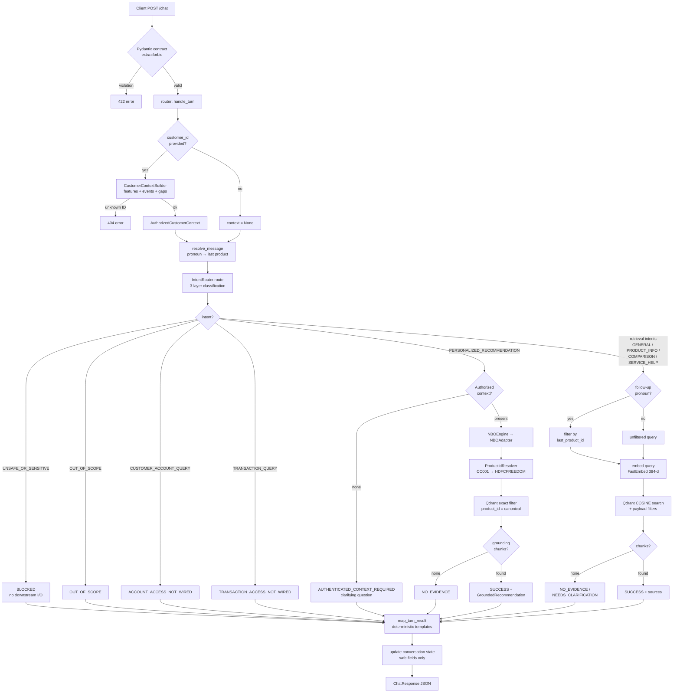
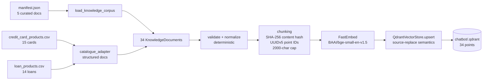
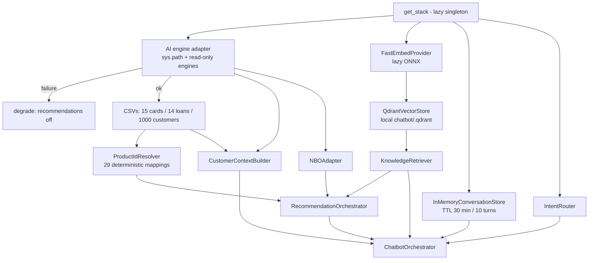
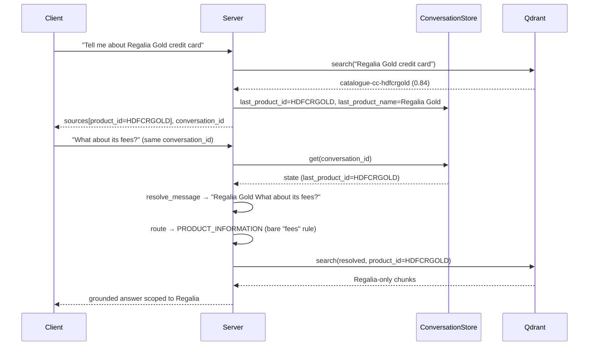
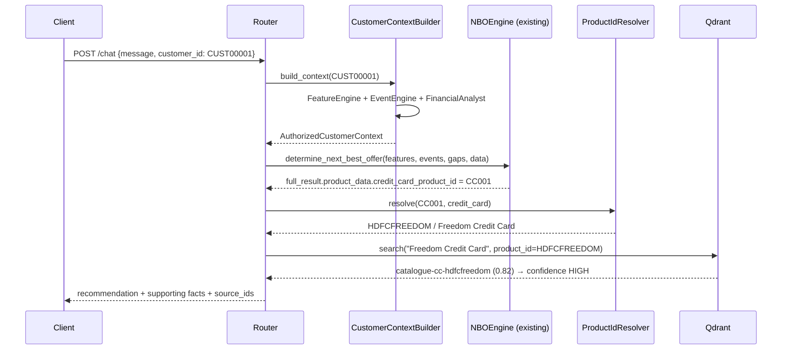

# Flowcharts

## 1. Chat request lifecycle

## 2. Knowledge ingestion pipeline

## 3. Initialization — ChatbotStack composition

## 4. Multi-turn follow-up (Hermes P2)

## 5. Personalized recommendation with grounding

